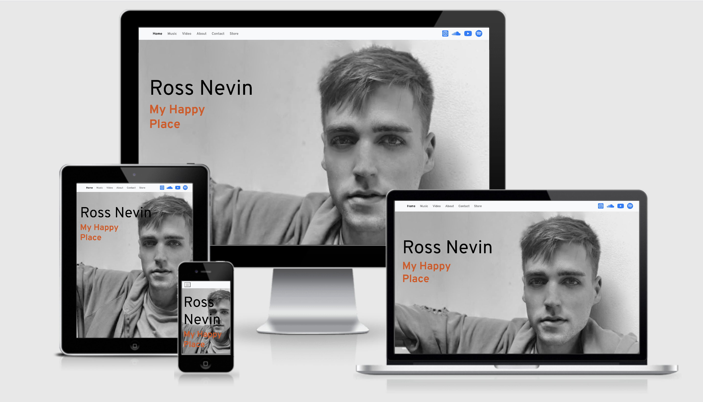

# Milestone Project 1 - **Ross Nevin** professional website

[View the live project here.](https://cau-correa.github.io/ms1/)

This website is a showcase of Ross Nevin. Irish singer, musician, song-writter, and music producer. 
Where all of those whom admire his work can have access to it and keep uptodate with his latest creations.

## UX

The aim of this project is to reach all people who love contemporary Irish music. Regardless of age, social class or ethnicity. Those who alredy like Ross Nevin's work and also those who want to know more about him. 

This webpage presents official information about Ross Nevin's career and music also provides secure access to the purchase of his music and direct contact to hire his work.

* As a fan of Ross Nevin's music, I want to purchase his album, so that I can listen to it.
* As an Irish music lover, I want to know about the new singers/song-writters, so I can have new content to listen to.
* As a fan of Ross Nevin's music, I want be uptodade with his latest muisic, so I can listen to it.
* As a person workin in the enterteinment business, I want to have contact to a singer/song-writter, so I can hire him.
* As a musician, I want to hear the music that is been made in ireland, so I can have a partnership or collaboration with him.

**IMPORTANT** dont forget to add wireframe

## Features

Home page, with Ross's picture in the background the user can easy access social media and other sections of the website, also a direct link to purchase his Album.
Music section, it's where is found the latest musics, the user is able to listen them in the browser or has an option to play them on Sound Cloud.
Video section, You Tube videos of Ross interacting with other musicians and bands. Also they can be watched in browser or on You Tube.
About section, brief desccription of Ross Nevin.
Contact section, the user there can have direct contact with him by e-mail, fill out a form to sign-Up for the news letter the form element does't have implemented backend server code to process it yet. and with google maps, see where geographically he is.
Footer, in the footer is the copyrights and social media icons, linking to Ross's social media accounts.

## Tecnologies Used
1. [Git](https://git-scm.com/) Was used for version controle by utilizing the Gitpod terminal to commit to Git and push it to GitHub. 
2. [GitHub](https://github.com) Used to store the project after been pushed from Git.
3. [Boostrap](https://getbootstrap.com/) The Bootstrap library was used throughout the project to assist with the responsiviness and styling of the website.
4. [FontAwesome](https://fontawesome.com/) The project uses Font Awesome icons.
5. [Google Fonts](https://fonts.google.com/) Google fonts was used to homogenize the project. The font imported to the style.css file was 'Overpass'.
6. [Google Maps](https://www.google.com/maps) Google maps was used to show Dublin in the contact section.
7. [jQuery](https://jquery.com/) jQuery was used to make the navbar responsive and also used for the modal dialog .

## Languages used
* HTML 5
* CSS 3
* JavaScript

## Testing

## Validation
* [W3C HTML Validator](https://validator.w3.org/)

The HTMl of this project went throug [W3C Marcup validation service](https://validator.w3.org/) having showed-up 6 errors all related to the Iframe code add from Sound Cloud.

The same error appears on lines: 77, 87, 97, 107, 117, and 127.

Error: Bad value 100% for attribute width on element iframe: Expected a digit but saw % instead. 

* [W3C CSS Validator](https://jigsaw.w3.org/css-validator/)

The CSS of this project went throug [W3C CSS Validation Service](https://jigsaw.w3.org/css-validator/), with no error found.

## Deployment
The deployment was made in the GitHub pages.
From my GitHub web page, I open the repository I want to deploy, in this case, “Cau-Correa/ms1”. Then at the top right of the page click on the 'Settings' link, and scroll down to the GitHub Pages section, I selected the master branch as source, click on save, and I was provided with the following message: Your site is published at https://cau-correa.github.io/ms1/

## Credits

### Code
The CSS code for the full page background image in the Home Section came from [CSS-Tricks](https://css-tricks.com/perfect-full-page-background-image/)

The CSS code for responsive embed a You Tube video in the HTML came for the You Tube Channel [Tipswithpunch](https://www.youtube.com/watch?v=9YffrCViTVk)

Bootstrap4: Bootstrap Library used throughout the project.

### Content
All content was written by the developer.

### Media
The photo used in the project belogs to Ross Nevin.

### Acknowledgements

My Mentor for continuous helpful feedback.
Tutor support at Code Institute for their support.

