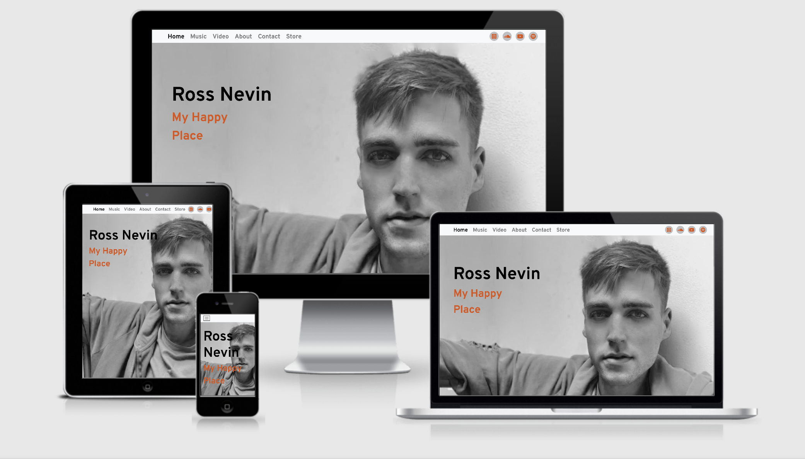
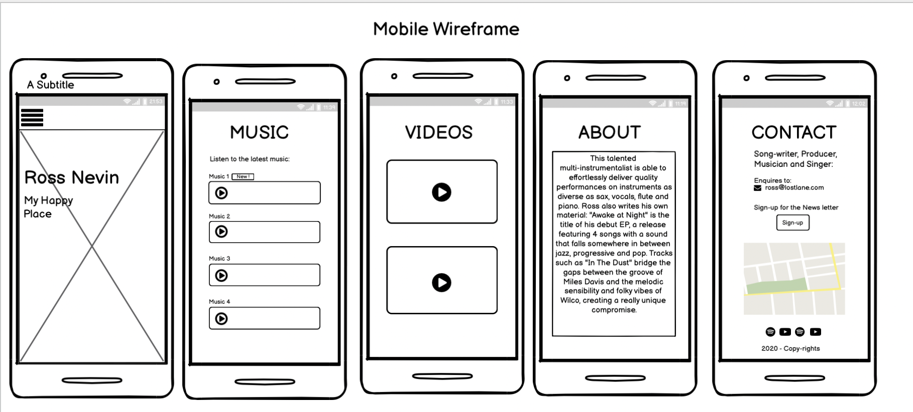
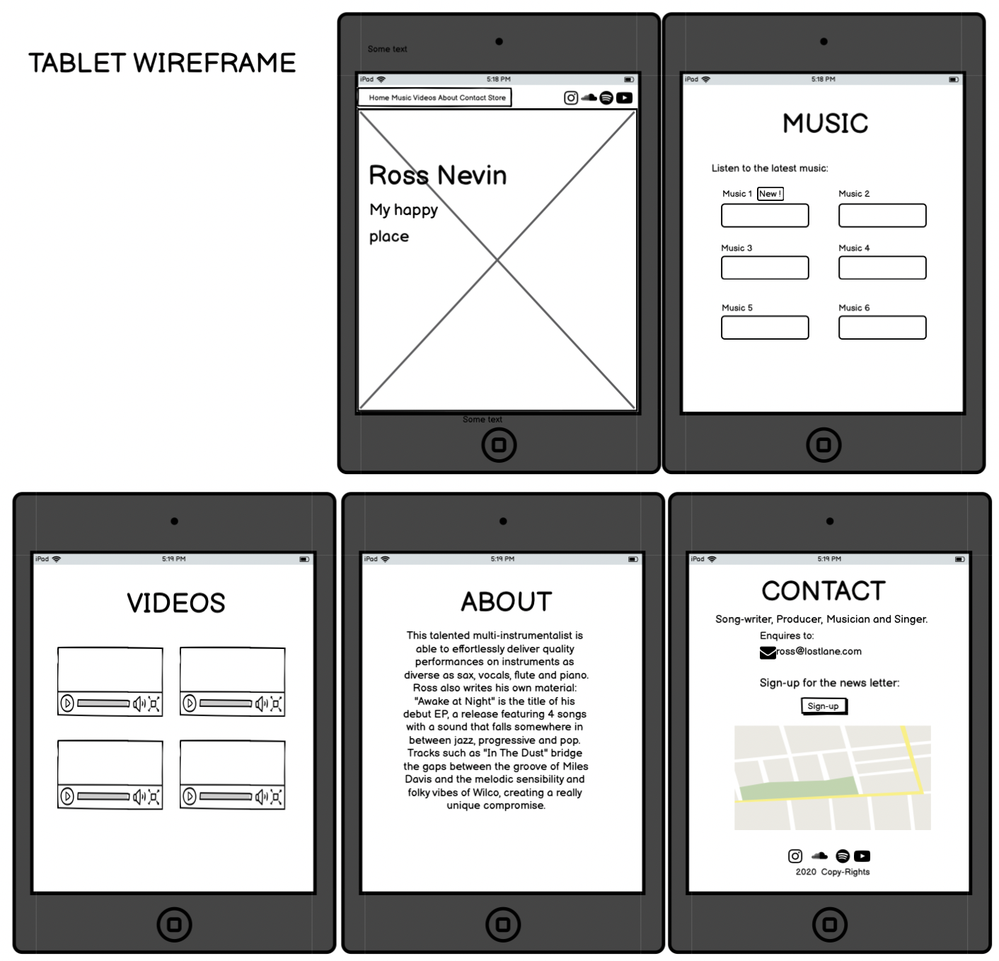
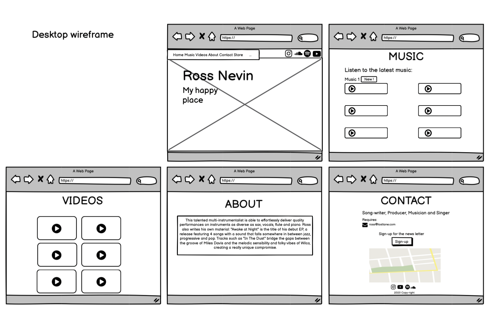
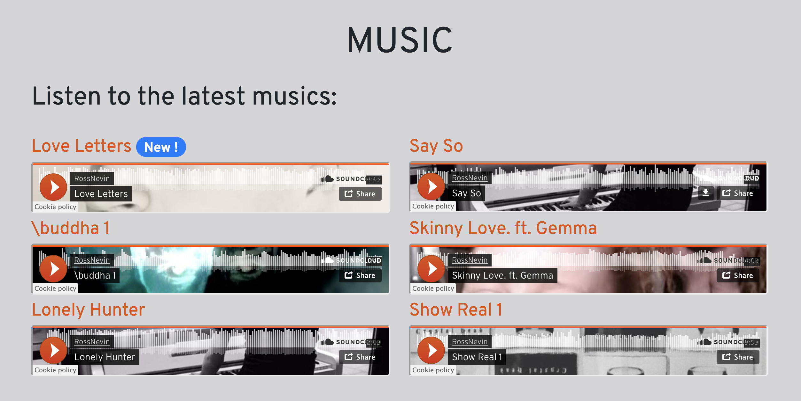
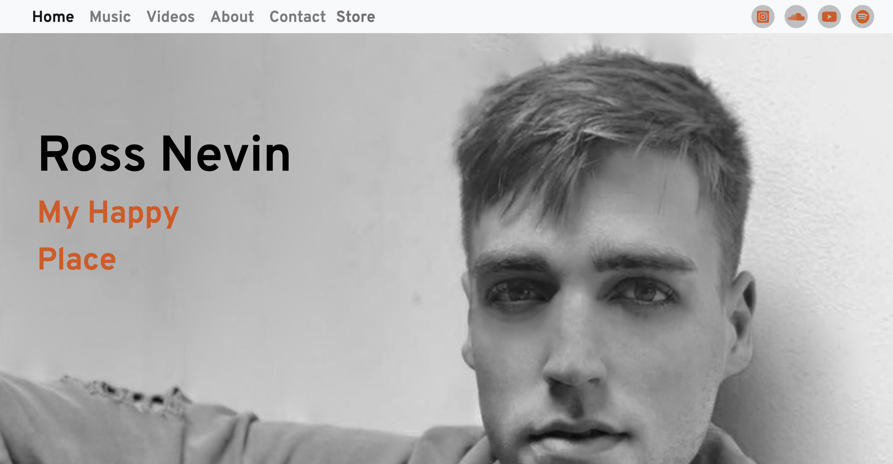
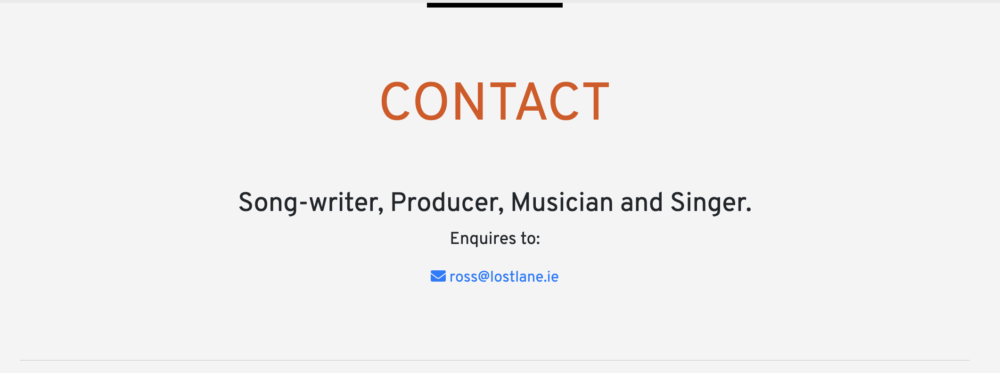

# Milestone Project 1 - **Ross Nevin** professional website

[View the live project here.](https://cau-correa.github.io/ross-nevin-music-ms1)

This website is a showcase of Ross Nevin. Irish singer, musician, song-writer, and music producer. 
Where all of those who admire his work can have access to it and keep up to date with his latest creations.

## UX

The aim of this project is to reach all people who love contemporary Irish music. Regardless of age, social class, or ethnicity. Those who already like Ross Nevin's work and also those who want to know more about him. 

This webpage presents official information about Ross Nevin's career and music. It also provides secure access to the purchase of his music and direct contact to hire him.

### User Stories
#### First time visitor goals:
* As a First Time Visitor, I want to know about new singers/songwriters, so I can have new content to listen to.
* As a First Time Visitor, I want to locate Ross's social media links to be able to follow him.

#### Returning visitor goals:
* As a Returning Visitor, I want to hear the music that has been made in Ireland, so I can have a partnership or collaboration with him.
* As a Returning Visitor, I want to have contact with a singer/songwriter, so I can hire him.

#### Frequent user goals:
* As a Frequent User, I can have access to the store page to purchase his album, so that I can listen to it.
* As a Frequent User, I want to be up-to-date with his latest music, so I can listen to it.
* As a Frequent User, I want to sign up for the Newsletter so that I can receive emails about Ross's music updates.

## Features

Home page, with Ross's picture in the background the user can easily access social media and other sections of the website, also a direct link to purchase his Album.

In the music section, it's where to find the latest music, the user is able to listen to them in the browser or has an option to play them on SoundCloud. I embedded the SoundCloud code in order to present his music.

Video section, YouTube videos of Ross interacting with other musicians and bands. Also, they can be watched in the browser or on YouTube. I embedded the YouTube code in order to present his videos.

About section, a brief description of Ross Nevin.

Contact section, the user there can have direct contact with him by email, fill out a form to sign-Up for the newsletter the form element doesn't have implemented backend server code to process it yet. and with google maps, see where he is geographical.

Footer, in the footer, is the copyrights and social media icons, linking to Ross's social media accounts.

## Future features

For the future is planned to add YouTube and Spotify pages to the social media icons, also make the sign-up form useful by implementing a backend to it.

## Technologies Used
1. [Git](https://git-scm.com/) Was used for version control by utilizing the Gitpod terminal to commit to Git and push it to GitHub. 
2. [GitHub](https://github.com) Used to store the project after it has been pushed from Git.
3. [Boostrap](https://getbootstrap.com/) The Bootstrap library was used throughout the project to assist with the responsiveness and styling of the website.
4. [FontAwesome](https://fontawesome.com/) The project uses Font Awesome icons.
5. [Google Fonts](https://fonts.google.com/) Google fonts were used to homogenize the project. The font imported to the style.css file was 'Overpass'.
6. [Google Maps](https://www.google.com/maps) Google maps were used to show Dublin in the contact section.
7. [jQuery](https://jquery.com/) jQuery was used to make the navbar responsive and also used for the modal dialog.

## Design

* ### Colour Scheme

The colours used are black, orange and shades of grey.

* ### Typography

The Overpass font is used throughout the whole website with Sans Serif as the fallback font. Besides being an attractive clean font, Overpass was appropriate because it's similar to the font "Interstate" used in the SoundCloud code embedded in the Music section. 

* ### Design choices

A reduction of content according to screen size was applied.
On Large screens the user can have access to the full content and enjoy a full experience the website provides.

But with reduction of screen size the content is accordingly reduced to keep providing a good experience on the website without having a confusing and crowded screen.
On a small screen size just 2 videos are shown on Video sections and instead of 6 just 4 music pieces are shown on music section.

Also on small screen size the navigation bar loses the social media links and turns into a button with the menu links to the other sections.

* ### Wireframe.

## Languages used
* HTML 5
* CSS 3
* JavaScript

## Testing

-   Friends and family members were asked to review the site and documentation to point out any bugs and/or user experience issues.
-   The Website was tested on Google Chrome, Firefox, and Safari browsers.
-   The website was viewed on a variety of devices such as desktop, laptop, ipad, samsung S9, iPhone8, iPhoneX, iphoneXs & iPhone11.

### Testing User Stories from User Experience (UX) Section

#### First Time Visitor Goals
##### * As a First Time Visitor, I want to know about the new singers/song-writters, so I can have new content to listen to.
1. In the Home section the user sees the name and picture of Ross Nevin, scrolling down the user will have access to music and videos, also a description of Ross's work in the About Section.
2. The user can listen to the music in the browser or have a choice to play it on the SoundCloud page.

3. The user can see Ross as a musician in the Video section. It's possible to watch in the browser or on YouTube, by clicking on the video's name.

##### * As a First Time Visitor, I want to locate Ross's social media links to be able to follow him.
1. For medium size screens up, the user can find links to the social media accounts on the top of the page at the right side of the navigation bar and scrolling down to the footer on the bottom of the page. 

2. For devices with small screens the social media links can be found only in the footer on the bottom of the page.

#### Returning Visitor Goals
##### * As a Returning Visitor, I want to hear the music that is being made in ireland, so I can have a partnership or collaboration with him.
1. The recent music is clearly shown in the Music Section.
2. The Contact section is on the navigation bar with a straight link to the section, also the user can scroll down to the bottom until the Contact section, the user can contact Ross by e-mail and also there are links to his social media accounts.

##### * As a Returning Visitor, I want to have contact with a singer/song-writter, so I can hire him.
1. In the navigation bar the user can go direct to the Contact section, then the user can contact Ross by e-mail also through his social media accounts, 
in the navigation bar on the top for larger screens and on the bottom for all screen sizes.

#### Frequent User Goals
##### * As a Frequent User, I can have access to the store page to purchase his album, so that I can listen to it.
1. The user can easily find a link to the store on top of the page in the navigation bar and click on it to be redirected to another page on a new window.

##### * As a Frequent User, I want to be up-to-date with his latest music, so I can listen to it.
1. The user is already comfortable navigating the website and can easily find Ross's new music in the Music section.

##### * As a Frequent User, I want to sign up to the Newsletter so that I can receive email about Ross's music updates.
1. At the bottom of the Contact section there is message inviting the user to sign-up to the newsletter, by clicking on the button Sign-up the user can
 fill out a form and submit it clicking on the submit button. 

## Fixed Bugs

At first the project didn't pass on the W3C Markup Validator shown-up 6 errors all related to the iframe code add from SoundCloud. The inline css styling was removed from the index.html file and correctly placed in the style.css file.

## Validation

To ensure there were no syntax errors in the project, the [W3C Markup Validator](https://validator.w3.org/) and [W3C CSS Validator Services](https://jigsaw.w3.org/css-validator/) were used to validate every page of the project.

* W3C HTML Validator

The HTMl of this project went through *W3C Markup validation service* With no errors or warnings to show.

* W3C CSS Validator

The CSS of this project went through *W3C CSS Validation Service*, with no error found.

* Lighthouse Google Chrome Tools 

|    |Mobile |Desktop |
|--- |--- |--- |
|Performance|69|84|
Accessibility|92|92|
Best Practices|86|79|
SEO|100|100|

## Deployment

### Git Commands
After writing the code on Gitpod, I used the Git Commands:

* git add and file or directory name, adds files to the staging area for Git.
* git commit -m "message", record the changes made to the files to a local repository.
* git push, sends local commits to the remote repository on GitHub. 

### GitHub Pages
The deployment was deployed to the GitHub pages.
From my GitHub web page, I open the repository I want to deploy, in this case, “Cau-Correa/ms1”. 
Then at the top right of the page click on the 'Settings' link, and scroll down to the GitHub Pages section, 
I selected the master branch as source, click on save, and I was provided with the following 
message: Your site is published at https://cau-correa.github.io/ms1/

### Forking the GitHub Repository

Once you locate the repository you want to fork, at the top right of the page below the right items in the navigation bar the fork button can be located.
Now you should have a copy of the original repository in your GitHub account.

### Making a Local Clone

You find step by step to how to clone a repository from GitHub to your computer on [GitHub Docs](https://docs.github.com/en/free-pro-team@latest/github/creating-cloning-and-archiving-repositories/cloning-a-repository) Cloning a repository from GitHub.

## Credits

### Code
It was used code from [YouTube](https://www.youtube.com/) embedded in the Videos section. 

It was used code from [SoundCloud](https://soundcloud.com/) embedded in the Videos section. 

The CSS code for the full page background image in the Home Section came from [CSS-Tricks](https://css-tricks.com/perfect-full-page-background-image/)

The CSS code for responsive embed a YouTube video in the HTML came for the YouTube Channel [Tipswithpunch](https://www.youtube.com/watch?v=9YffrCViTVk)

Bootstrap4: Bootstrap Library used throughout the project.

The code for the back to top button was from [W3schools](https://www.w3schools.com/default.asp).

### Content
All content was written by the developer.

### Media
The photo used in the project belongs to Ross Nevin.

Music played on this website was written and produced by Ross Nevin.

##### You Tube videos provided by:
Ross Nevin was part of the bands and musical groups in which he appears in the videos shown on this website.

Video: LAOISE - Halfway (Live at the Ruby Sessions) provided by [
Ruby Sessions TV](https://www.youtube.com/channel/UC5HskCVUBaLF9Y-R6KYq8eA)

Video: The Cazettes - 'At Last' (Etta James Cover) provided by [
The Cazettes](https://www.youtube.com/channel/UCk1zqfrLeSZd9sVN1K4Gi4Q)

Video: Paul Gordon performing 'Wander Lust' at the BIMM Dublin End of Term Gig, May 2016 provided by [BIMM](https://www.youtube.com/channel/UCmA64TnsaDBwd11EcOZKkCQ)

Video: Helen Holligan - Drifting (Live At Straffan Antiques) provided by [
Helen Holligan Music](https://www.youtube.com/channel/UC1L4ypXj77aRaEEvj2zHvPw)

Video: Monsoon Season - Day Dreaming (Live At Straffan Antiques) provided by [
Helen Holligan Music](https://www.youtube.com/channel/UC1L4ypXj77aRaEEvj2zHvPw)

Video: The Cazettes - 'Let's Stay Together' (Al Green Cover)(Etta James Cover) provided by [
The Cazettes](https://www.youtube.com/channel/UCk1zqfrLeSZd9sVN1K4Gi4Q)

### Acknowledgements

My Mentor Reuben Ferrante for his help and feedback.

Tutor support at Code Institute for their support.

To the Slack Community for helping me with my silly questions.

