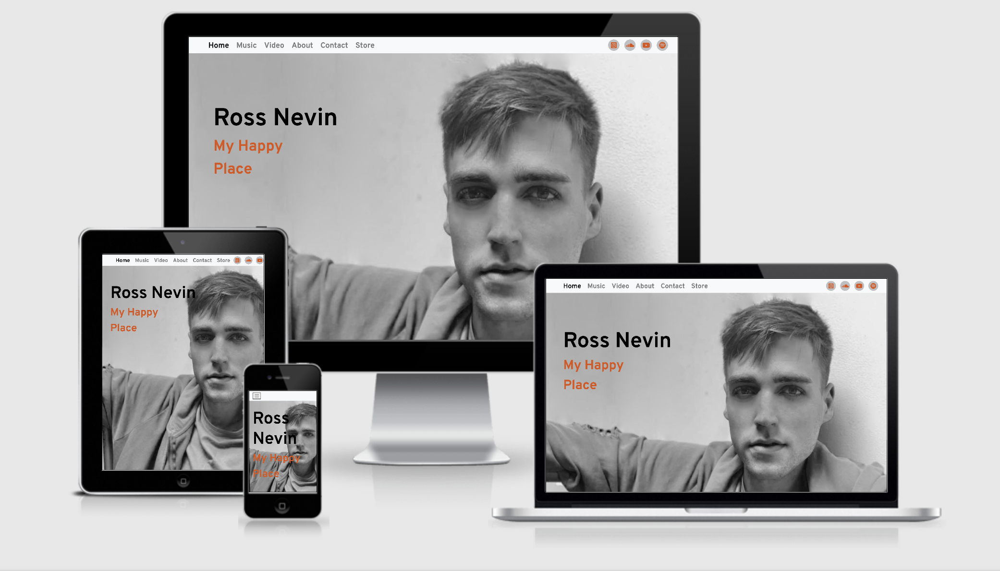
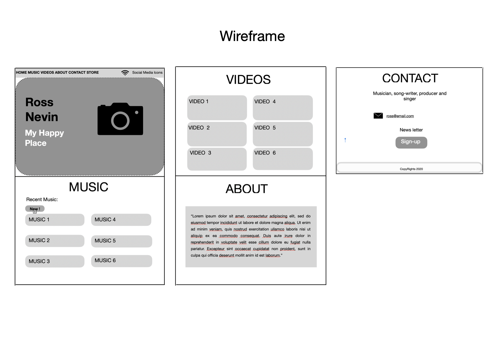

# Milestone Project 1 - **Ross Nevin** professional website

[View the live project here.](https://cau-correa.github.io/ms1/)

This website is a showcase of Ross Nevin. Irish singer, musician, song-writter and music producer. 
Where all of those who admire his work can have access to it and keep up to date with his latest creations.

## UX

The aim of this project is to reach all people who love contemporary Irish music. Regardless of age, social class or ethnicity. Those who alredy like Ross Nevin's work and also those who want to know more about him. 

This webpage presents official information about Ross Nevin's career and music. It also provides secure access to the purchase of his music and direct contact to hire him.

### User Strories
#### First time visitor goals:
* As a First Time Visitor, I want to know about new singers/song-writters, so I can have new content to listen to.
* As a First Time Visitor, I want want to locate Ross's social media links to be able to follow him.

#### Returning visitor goals:
* As a Returning Visitor, I want to hear the music that is been made in Ireland, so I can have a partnership or collaboration with him.
* As a Returning Visitor, I want to have contact to a singer/song-writter, so I can hire him.

#### Frequent user goals:
* As a Frequent User, I can have access to the store page to purchase his album, so that I can listen to it.
* As a Frequent User, I want be up-to-date with his latest muisic, so I can listen to it.
* As a Frequent User, I want to sign up to the Newsletter so that I can receive email about Ross's music updates.

## Features

Home page, with Ross's picture in the background the user can easy access social media and other sections of the website, also a direct link to purchase his Album.

Music section, it's where to found the latest music, the user is able to listen them in the browser or has an option to play them on Sound Cloud.

Video section, You Tube videos of Ross interacting with other musicians and bands. Also they can be watched in browser or on You Tube.

About section, brief desccription of Ross Nevin.

Contact section, the user there can have direct contact with him by e-mail, fill out a form to sign-Up for the news letter the form element does't have implemented backend server code to process it yet. and with google maps, see where he is geographically.

Footer, in the footer is the copyrights and social media icons, linking to Ross's social media accounts.

## Future features

For the future is planed to add You Tube and Spotify pages to the social media icons, also make the sign-up form useful by implementing backend to it.

## Tecnologies Used
1. [Git](https://git-scm.com/) Was used for version control by utilizing the Gitpod terminal to commit to Git and push it to GitHub. 
2. [GitHub](https://github.com) Used to store the project after it has been pushed from Git.
3. [Boostrap](https://getbootstrap.com/) The Bootstrap library was used throughout the project to assist with the responsiviness and styling of the website.
4. [FontAwesome](https://fontawesome.com/) The project uses Font Awesome icons.
5. [Google Fonts](https://fonts.google.com/) Google fonts was used to homogenize the project. The font imported to the style.css file was 'Overpass'.
6. [Google Maps](https://www.google.com/maps) Google maps was used to show Dublin in the contact section.
7. [jQuery](https://jquery.com/) jQuery was used to make the navbar responsive and also used for the modal dialog .

## Design

* ### Colour Scheme

The colours used are black, orange and shades of grey.

* ### Typography

The Overpass font is used throughout the whole website with Sans Serif as the fallback font. Besides been an attractive clean font, Overpass was appropriate because its similar to the fount "Interstate" used in the SoundCloud code imbeded in the Music section. 

* ### Design choices

A reduction of content according with screen size was applied.
On Large screens the user can have access to the full content and enjoy a full experience the website provides.

But with reduction of screen size the content is accordingly reduced to keep providing a good experience on the website without having a confusing and crowded screen.
On small screen size just 2 videos are shown on Video sections and instead of 6 just 4 music pieces are shown on Muisc section.

Also on small screen size the navigation bar loses the social media links and turns into a buttom with the menu links to the other sections.

* ### Wireframe.

      

## Languages used
* HTML 5
* CSS 3
* JavaScript

## Testing

-   Friends and family members were asked to review the site and documentation to point out any bugs and/or user experience issues.
-   The Website was tested on Google Chrome, Fire fox, and Safari browsers.
-   The website was viewed on a variety of devices such as Desktop, Laptop, ipad, sansungS9, iPhone8, iPhoneX, iphoneXs & iPhone11.

### Testing User Stories from User Experience (UX) Section

#### First Time Visitor Goals
##### * As a Fist Time Visitor, I want to know about the new singers/song-writters, so I can have new content to listen to.
1. In the Home section the user sees the name and picture of Ross Nevin, scrolling down the user will have access to music and videos, also a description of Ross's work in the About Section.
2. The user can listen the music in the browser or have a choice to play it on the SoundCloud page.
3. The user can see Ross as an musician in the Video section. It's possible to watch in the browser or on You Tube page, by clicking on the video's name.

##### * As a First Time Visitor, I want want to locate Ross's social media links to be able to follow him.
1. For mediun size screens up, the user can find links to the social media acconts on the top of the page at the right side of the navigation bar and scrolling down to the footer on the bottom of the page. 
2. For divices with small screens the social media links can be found only in the footer on the bottom of the page.

#### Returning Visitor Goals
##### * As a Returning Visitor, I want to hear the music that is being made in ireland, so I can have a partnership or collaboration with him.
1. The recent music is clearly shown in the Music Section.
2. The Contact section is on the navigation bar with straight link to the section, also the user can scroll down to the bottom untill the Contact section, the user can contact Ross by e-mail and also there are links to his social media accounts.

##### * As a Returning Visitor, I want to have contact with a singer/song-writter, so I can hire him.
1. In the navigation bar the user can go direct to the Contact section, then the user can contact Ross by e-mail also through his social media accounts, 
in the navigation bar on the top for larger screens and on the bottom for all screen sizes.

#### Frequent User Goals
##### * As a Frequent User, I can have access to the store page to purchase his album, so that I can listen to it.
1. The user can easily find a link to the strore on top of the page in the navigation bar and click on it to be re-directed to another page on a new window.

##### * As a Frequent User, I want be up-to-date with his latest muisic, so I can listen to it.
1. The user is already comfortable navigating the website and can easily find Ross's new music in the Music section.

##### * As a Frequent User, I want to sign up to the Newsletter so that I can receive email about Ross's music updates.
1. At the bottom of the Contact section there is message inviting the user to sign-up to the News Letter, by clicking on the button Sign-up the user can
 fill out a form and submit it clicking on the submit buttom. 

### Validation

To ensure there were no syntax errors in the project, the [W3C Markup Validator](https://validator.w3.org/) and [W3C CSS Validator Services](https://jigsaw.w3.org/css-validator/) were used to validate every page of the project.

* W3C HTML Validator

The HTMl of this project went throug *W3C Marcup validation service* having showed-up 6 errors all related to the Iframe code add from Sound Cloud.

The same error appears on lines: 77, 87, 97, 107, 117, and 127.

Error: Bad value 100% for attribute width on element iframe: Expected a digit but saw % instead. 

* W3C CSS Validator

The CSS of this project went throug *W3C CSS Validation Service*, with no error found.

## Deployment

### Git Commands
After writing the code on Gitpod, I used the Git Commands:

* git add and file or diretory name, adds files to the staging area for Git.
* git commit -m "message", record the changes made to the files to a local repository.
* git push, sends local commits to the remote repository on GitHub. 

### GitHub Pages
The deployment was deployed to the GitHub pages.
From my GitHub web page, I open the repository I want to deploy, in this case, “Cau-Correa/ms1”. 
Then at the top right of the page click on the 'Settings' link, and scroll down to the GitHub Pages section, 
I selected the master branch as source, click on save, and I was provided with the following 
message: Your site is published at https://cau-correa.github.io/ms1/

### Forking the GitHub Repository

Once you located the repository you want to fork, at the top right of the page below the right items in the navigation bar the fork buttom can be located.
Now you should have a copy of the original repository in your GitHub account.

### Making a Local Clone

You find step by step to how to clone a repository from GitHub to your computer on [GitHub Docs](https://docs.github.com/en/free-pro-team@latest/github/creating-cloning-and-archiving-repositories/cloning-a-repository) Cloning a repository from GitHub.

## Credits

### Code
The CSS code for the full page background image in the Home Section came from [CSS-Tricks](https://css-tricks.com/perfect-full-page-background-image/)

The CSS code for responsive embed a You Tube video in the HTML came for the You Tube Channel [Tipswithpunch](https://www.youtube.com/watch?v=9YffrCViTVk)

Bootstrap4: Bootstrap Library used throughout the project.

Also [W3schools](https://www.w3schools.com/default.asp).

### Content
All content was written by the developer.

### Media
The photo used in the project belogs to Ross Nevin.

### Acknowledgements

My Mentor Reuben Ferrante for his help and feedback.
Tutor support at Code Institute for their support.
To the Slack Community for helping me with my silly questions.

